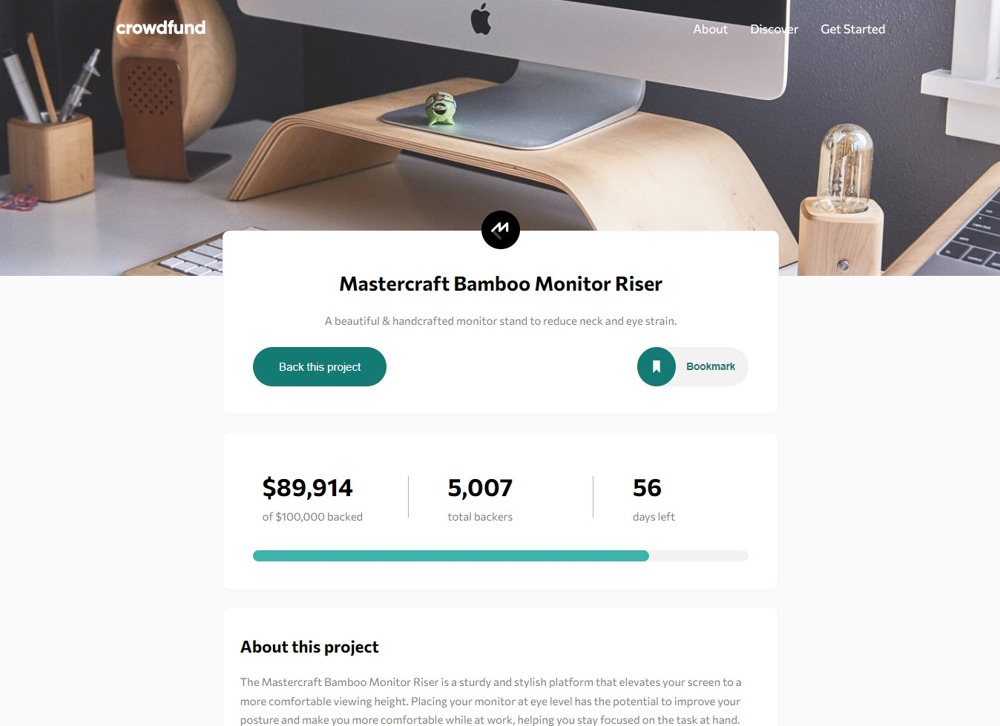
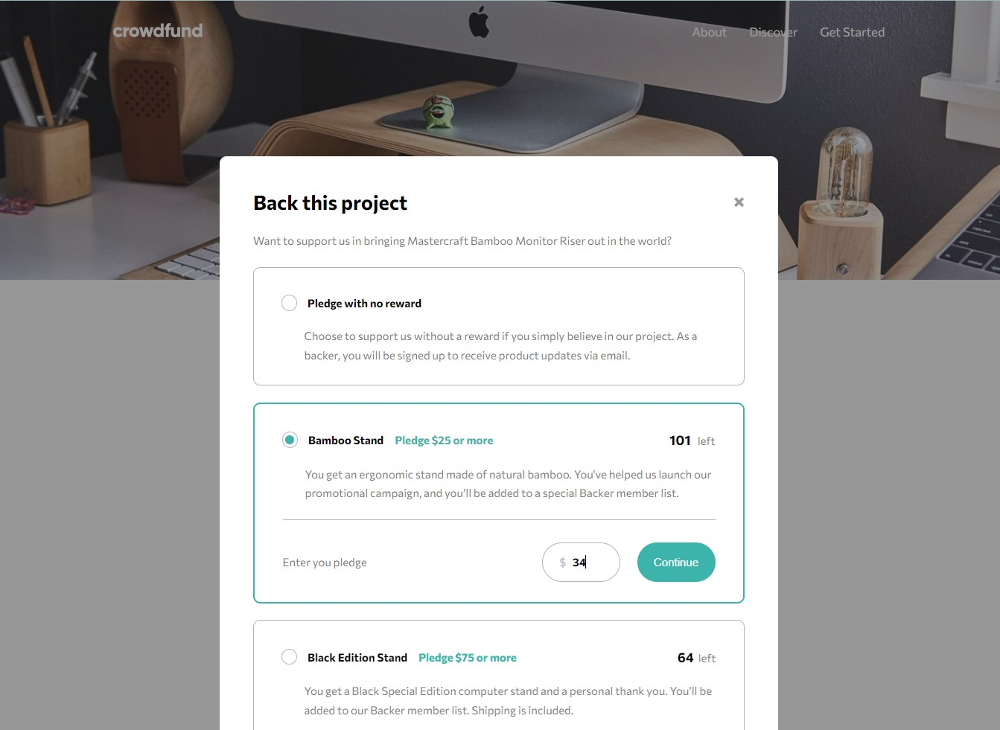
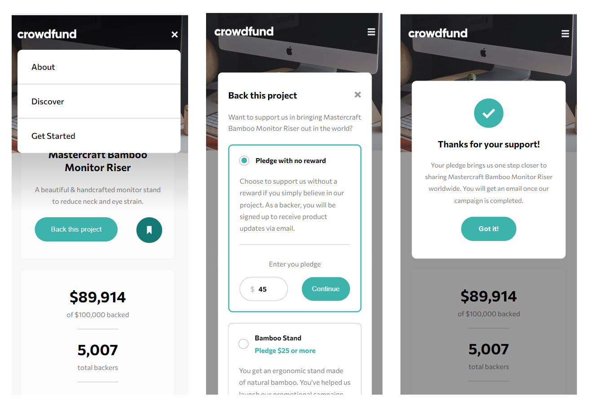

# Frontend Mentor - Crowdfunding product page solution

This is a solution to the [Crowdfunding product page challenge on Frontend Mentor](https://www.frontendmentor.io/challenges/crowdfunding-product-page-7uvcZe7ZR). Frontend Mentor challenges help you improve your coding skills by building realistic projects.

## Table of contents

- [Overview](#overview)
  - [The challenge](#the-challenge)
  - [Screenshot](#screenshot)
  - [Links](#links)
- [My process](#my-process)
  - [Built with](#built-with)
  - [What I learned](#what-i-learned)
  - [Continued development](#continued-development)
  - [Useful resources](#useful-resources)
- [Author](#author)
- [Acknowledgments](#acknowledgments)

## Overview

### The challenge

Users should be able to:

- View the optimal layout depending on their device's screen size
- See hover states for interactive elements
- Make a selection of which pledge to make
- See an updated progress bar and total money raised based on their pledge total after confirming a pledge
- See the number of total backers increment by one after confirming a pledge
- Toggle whether or not the product is bookmarked

### Screenshot


<br>
<br>
<br>

<br>
<br>
<br>


### Links

- Solution URL: [https://github.com/Radu-A/crowdfunding-product-page-main](https://github.com/Radu-A/crowdfunding-product-page-main)
- Live Site URL: [https://crowdfunding-product-page-main-iota.vercel.app/](https://crowdfunding-product-page-main-iota.vercel.app/)

## My process

### Built with

- Semantic HTML5 markup
- CSS custom properties
- Flexbox
- Mobile-first workflow
- [React](https://reactjs.org/) - JS library
- [SASS](https://sass-lang.com/) - CSS extension

### What I learned

- The logic of doing a modal with React and CSS. Basically, changing the class of the element; one class is hidden and the other not. Also using a semitransparent div to darken the screen behind the menu.
- Use of react-responsive to make media queries and to render some elements depending on the size of the screen. Elements like background image or buttons.
- SASS: Nesting, variables, mixins and folder structure.
- Common CSS: media queries, flexbox, selectors.

```html
{isDesktop ? (
<button className="{bookmarkedButtonClass}" onClick="{handleClick}">
  {bookmarkedButtonClass === "bookmark-button" ? (
  
  ) : (
  
  )}
  <span>Bookmark</span>
</button>
) : (
<button className="{bookmarkedButtonClass}" onClick="{handleClick}">
  {bookmarkedButtonClass === "bookmark-button" ? (
  
  ) : (
  
  )}
</button>
)}
```

```css
.menu-mobile {
  display: none;
  padding: 0;
  width: 90%;
  top: 5rem;
  position: fixed;
  background-color: white;
  opacity: 1;
  border-radius: 10px;
  z-index: 3;

  .menu-item {
    height: 5rem;
    flex: 1;
    @include flex-row;
    justify-content: start;

    a {
      margin: auto 2rem;
    }
  }

  .menu-item:first-child,
  .menu-item:nth-child(2) {
    border-bottom: 1px solid $medium-gray;
  }
}
```

### Continued development

- Implement smooth transitions with CSS when opening and closing modals
- Better components structure

### Useful resources

- [React-Responsive](https://www.npmjs.com/package/react-responsive) - React-Responsive is a library that makes it easy to apply media queries.
- [Tutorial](https://webdesign.tutsplus.com/how-to-build-a-responsive-navigation-bar-with-flexbox--cms-33535t) - This tutorial shows you very clear how to do a responsive navbar with vanilla JavaScript. After learn the logic, you have to change some things to make it work in React.

## Author

- Github - [@Radu-A](https://github.com/Radu-A)
- Frontend Mentor - [@Radu-A](https://www.frontendmentor.io/profile/Radu-A)
- Linkedin - [Víctor Outeiro](https://www.linkedin.com/in/victor-outeiro/)

## Acknowledgments

Thanks to my teachers at the Bootcamp and to my classmates.
